Enabling Product, Customer Success, Support, and Retailers access to long term, network wide
insights into takeoff's systems along with interactions with takeoff systems such as
productivity metrics. To achieve these goals, we work with main engineering teams such as inbound, and outbound
to pipe their data into big data technologies such as Big Query, and generate meaningful
datasets, known as the Data Mart, and expose them to our users with visualization tooling.

Ingestion and Visualization
---------------------------

The core of the data domain is to ingest from the live services via event streams or scraping/polling,
transform the data into meaningful metrics such as productivity and expose those metrics as dashboards
and explores.

* __Data Lake__: Focuses on storing raw data long term.
* __Scrapers__: Focuses on querying databases or APIs of services to store them in the data lake. This is considered an anti-pattern is on life-support.
* __Data Mart__: Curated insights from the service data stored within the Data Lake such as utilization and productivity
  metrics.
* __Looker__: Exposes the Data Mart to our customers including retailers. It has a powerful query engine and
  visualization tooling.

```mermaid
flowchart LR
    Service["Service"]
    Topic["Topic"]
    Subscription["Subscription"]
    BigQueryTable["Big Query Table"]
    DataMartTransform["Transform Job"]
    DataMartTable["BQ Table"]
    Looker["Looker
            Visualizations"]
    Users(["Product
            Customer Success
            Support
            Retailers"])
    
    
    subgraph Producers
    Service -->|Publishes Events|Topic
    end
    
    subgraph DataLake["Data Lake"]
    Topic -.->|Consumes events from Producer|Subscription
    Subscription -->BigQueryTable
    end
    
    subgraph DataMart["Data Mart"]
    BigQueryTable -->|queries many Data Lake tables| DataMartTransform
    DataMartTransform --> DataMartTable
    end
    
    DataMartTable --> Looker
    Looker --> Users
```

Slotting Recommendations
------------------------

To optimize sites better to achieve higher order fulfillment throughput, tools are offered to
better position/slot product within the site's zones including the __OSR__ and __Manual__.

These tools have been largely on life support and very little is known about them and how they work.

* __Initial Slotting__: For internal sales folks to attempt proving the solution's effectiveness given existing sales data from the client. It hasn't been updated in years though and lack knowledge of how it works.
  * Git Repo: [Modelling](https://github.com/takeoff-com/Modelling)
  * Deployed By Git Repo: [data-science-infra](https://github.com/takeoff-com/data-science-infra)
  * Example site configuration: [data-science-infra](https://github.com/takeoff-com/data-science-infra/blob/master/dsm/env/production/dynamic_slotting_config/demand_forecaster/parameters-abs-2776.yaml)
* __Dynamic Slotting__: The engine/solver for the Assortment Management Platform (AMP) recommendations page on TOM. 
  * __Item Sales Loader__: Generates sales data based on lines within orders from the order management system sourced from the data lake.
    * Git Repo: [data-science-infra](https://github.com/takeoff-com/data-science-infra/blob/58cb65a497d241ab5c190f6f67ac232e49182bc0/dsm/scripts/update_item_sales_from_oms.sql#L4)
    * scheduled by the apached airflow / gcp composer instance. [Example](https://console.cloud.google.com/composer/dags/us-central1/production-dm-composer-usc1/dag_update_item_sales_oms_WINGS/runs?project=prj-daas-p-prod-ds-infra-9a5f)
  * __Demand Forecaster__: Generates demand predictions based on the oms generated item sales
    * Git Repo: [DemandForecaster](https://github.com/takeoff-com/DemandForecaster)
    * Deployed By Git Repo: [data-science-infra](https://github.com/takeoff-com/data-science-infra)
    * scheduled by the apache airflow / gcp composer instance. [Example](https://console.cloud.google.com/composer/dags/us-central1/production-dm-composer-usc1/dag_run_slotting_wings_9201/runs?project=prj-daas-p-prod-ds-infra-9a5f)
  * Solver for Dynamic Inventory Allocation (SDIA)
    * Git Repo: [Solver for Dynamic Inventory Allocation](https://github.com/takeoff-com/SDIA)
    * Deployed By Git Repo: [data-science-infra](https://github.com/takeoff-com/data-science-infra)
    * scheduled by the apache airflow / gcp composer instance. [Example](https://console.cloud.google.com/composer/dags/us-central1/production-dm-composer-usc1/dag_run_slotting_wings_9201/runs?project=prj-daas-p-prod-ds-infra-9a5f)

Project Management
------------------


**Git Repo**: [tf-data-analytical-services-project-builder](https://github.com/takeoff-com/tf-data-analytical-services-project-builder)

**Environments**:

* production: `prj-daas-p-prj-builder-b3a6`
* nonprod: `prj-daas-n-prj-builder-4e29`


As all of these components are deployed to the Google Cloud Platform (GCP), GCP needs bootstrapping permissions so the individual repos may deploy to their corresponding projects.
This Terraform based repository manages creation of GCP projects and some cross project permissions.