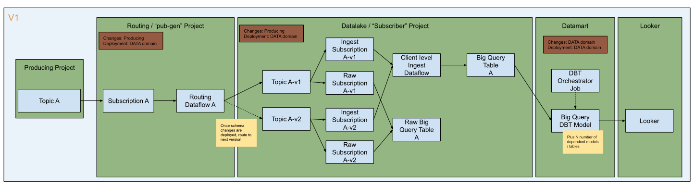
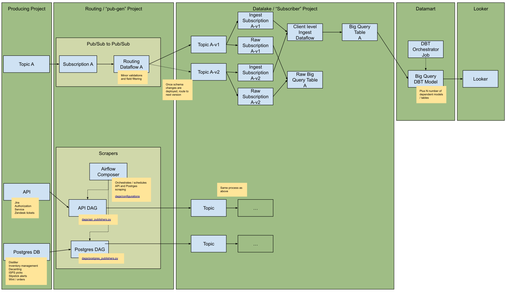
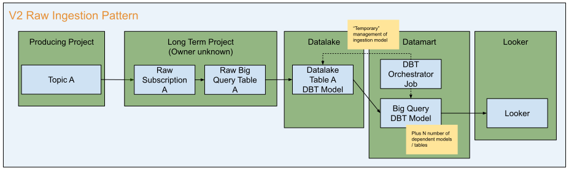

Stores data into big query from various sources and ingests data via subscriptions and scraping techniques.
The Data Lake stores data in big query in 2 patterns. schema-fied / legacy (`sub-bq`) and raw / v2 (`dl-ingest`).
The scrapers reside in the `pub-gen` projects.

The primary consumer of the data lake is the data mart which is consumed by looker.

Data Lake V1
------------


**Git Repo**: [daas-data-lake-sub-dataflow-bigquery](https://github.com/takeoff-com/daas-data-lake-sub-dataflow-bigquery)

__Environments__:

* Production: `prj-daas-p-prd-dl-sub-bq-380d`
* Nonprod/Staging: `prj-daas-n-stg-dl-sub-bq-b703`
* Dev: `prj-daas-n-dev-dl-sub-bq-9220` (unused)


The V1 data lake in google cloud platform was implemented primarily using Google pubsub and dataflow.
All events are:

1. transformed in some into json via external sources such as `pub-gen`
2. published onto Google pubsub topics owned by the v1 data lake
3. consumed by the big query data flow that:
    * validates the json events with a strict schema
    * writes the events to a strongly typed big query table

[source](https://docs.google.com/drawings/d/1OK73f4D7Ei0YPMajsADu7E-whsf8hQFNhMBsCkJ2pfI)

The team deemed this approach had too many problems such as:

* High blast radius when deploying due to a single change to any config or code would trigger downtime for all clients
  across all pipelines
* Too many hand-offs between upstream team changes and the data domain team such as PR reviews and deployments to
  various environments. Lack of ownership became an issue too, such as who was responsible for pushing a change made by
  another team.

{}
This data lake remains active due to existing integrations such as the scrapers, inventory-management, and the dynamic
slotting engine/components.
{}

### Scrapers


**Git Repos**:

* [daas-data-lake-sub-dataflow-bigquery](https://github.com/takeoff-com/daas-data-lake-pub-generator): Main scraper
  project.
* [daas-data-lake-pub-generator-secrets](https://github.com/takeoff-com/daas-data-lake-pub-generator-secrets): Deploys
  secrets used by picker assignments.
* [daas-transformer-picker-assignments](https://github.com/takeoff-com/daas-transformer-picker-assignments): generates
  picker assignment events based on order events.

**Environments**:

* Production: `prj-daas-p-prd-dl-pub-gen-7ad6`
* Nonprod/Staging: `prj-daas-n-stg-dl-pub-gen-25d0`
* Dev: `prj-daas-n-dev-dl-pub-gen-291b` (unused)


The scrapers directly connect to API's or databases of upstream servicecs. They are a legacy component that is a
stop-gap for storing business critical data such as inventory and orders.
It is built with python orchestrated by apache airflow which schedules jobs to be executed.

[source](https://docs.google.com/drawings/d/1Dhu_Hoii2JT7pHoFUnkyqaEPA2q5GA05tvzm-Yoy2HM)

Data Lake V2
------------


**Git Repo**: [daas-data-lake-ingestion](https://github.com/takeoff-com/daas-data-lake-ingestion)

**Environments**:

* production: `prj-daas-p-dl-ingest-311b`
* nonprod: `prj-daas-n-dl-ingest-d8c6`
* dev: `prj-daas-d-dl-ingest-3519` (PR review only)


The `Raw Ingestion Pattern` (V2) was devised to remediate the major issues the data domain team experienced when
updating the legacy data lake and interacting with upstream teams. The goal is to primarily utilize GCP's pubsub to
big query table integration; so its mostly just terraform / infrastructure code. The "schema-fication" of the data
moved to the data mart layer (meant to be temporary) to simplify the pipeline further while focusing on business logic.

[source](https://docs.google.com/drawings/d/1ApQ4CPuFcrNe1nun7LI7rt5QIDkYNxUzmPIqTHDWmZs)

{}
The
datamart ([datawarehouse-etl](https://github.com/takeoff-com/datawarehouse-etl/tree/master/dbt/clients_datamart/models/datalake_v2))
currently maintains the schema-fication of the raw json
{}