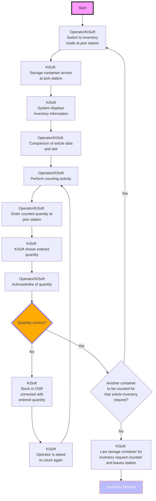
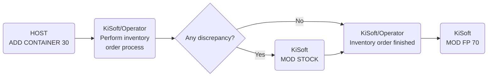
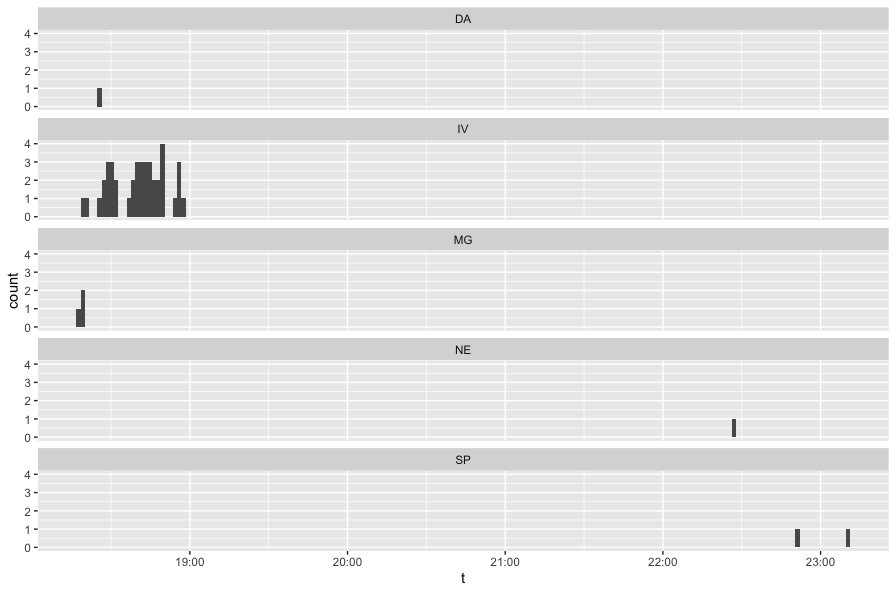
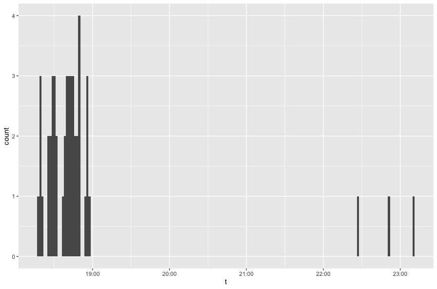
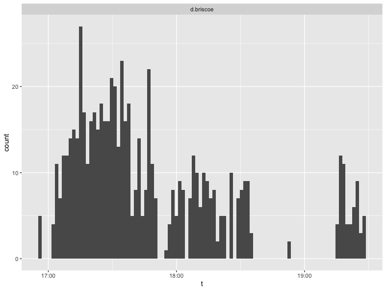
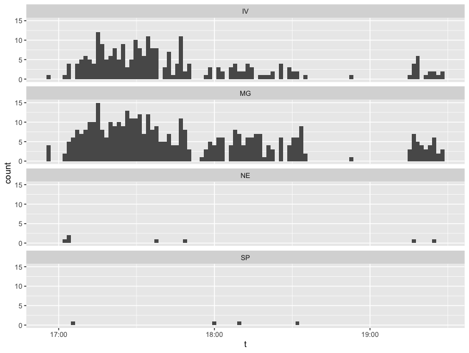

# KNAPP-42 General and Specific Inventory Productivity

## Introduction


Initially Takeoff software has been focused around two obvious processes 

- Inbound goods flow - Decanting
- Outbound goods flow - Picking

Hense both microservices architecture and data analytics was focused around those two processes - Decanting and Picking.

As the solution is maturing, it is necessary to provide visibility, and eventually, control into the following auxiliary activities that **enable** the Decanting and Picking processes. 

- Inventory - reconcyle the Kisoft Oracle database state to the actual Physical state of the slots within the storage totes
- Merge - combine two half-full **slots** into a single full slot, so that a single slot can be completely empty 
- Defragmentation - combine two half-full storage **totes** into a single full tote

When Inventory is not performed on a regular basis - Picking accuracy is suffering. Without Merge activities, the capacity of OSR is reduced, hence both Decanting and Picking processes become less efficient. Without Defragmentation being performed on a regular basis, there might not be a free tote to Decant the products that have just arrived.

Let's examine the "Figure 25 Flowchart - Inventory" from [1], it has been redrawn below 




## Inventory Productivity

The goal of the request is to 

>  The goal is to capture 
>
> - labor hours spent, 
>
> - number of unique SKUs counted, 
>
> - number of units counted, and 
>
> - number of totes counted 
>
> during general and specific inventory.


The acceptance listed are 

> ACCEPTANCE CRITERIA
> Dimensions of message:
>
> - Timestamp of inventory action
> - Item ID
> - License plate of tote
> - User ID
> - Picking Station ID
> - Adjustment amount. If no adjustment is made, then 0.
>   Message sent for every general / specific inventory action.


However, it is unclear on how the 'Timestamp of inventory action' (point in time) will be converted into the 'labor hours spent' (duration). 

(?) The rules need to be set for

- intervals definition - e.g. how 'busy' intervals are being calculated based on the time series containig timestamps for events
- aggregation of intervals - how the 'busy' intervals are aggregared across time spans, like 
  - day
  - 24h
  - week
  - month
  - shift

It may be viable to measure the whole time between node 'Start' and 'Inventory Finished' for the purposes of tracking the labor hours.


## API Messages for Inventory Process

As defined in the  section '6.9.7 Inventory orders '[1] the following three messages are issued via KiSoft while inventoy process is being performed



## Examples

Examples have been collected from the Loblaws site.

### Example A Quantity  Matched


### MOD STOCK

### 

```json
{
  "id": 10091553,
  "action": "mod",
  "records": [
    {
      "qty": 3,
      "itemno": "20101039_EA",
      "reason": "IV",
      "slot-id": 1,
      "pin-code": "SCASTIL",
      "recordid": "st",
      "locno-act": "22",
      "timestamp": "20220203124621",
      "expiry-date": "20220327000000",
      "licenceplate": "10038446",
      "master-fp-name": "osr",
      "adjustment-type": "a"
    }
  ],
  "recordid": "ev",
  "systemid": "02",
  "subaction": "stock"
}
```


## Possible Approach


##### Example 1

 in a spreadsheet retrieved via the following query from the Message Store at Loblaws [2]

```postgresql
select message_body_json ->> 'id'                                         as message_id,
       to_timestamp(generated_timestamp_millis / 1000)                    as time_message_store,
       generated_timestamp_millis                                         as time_utc_millis,
       (message_body_json ->> 'records')::json -> 0 ->> 'qty'             as qty,
       (message_body_json ->> 'records')::json -> 0 ->> 'itemno'          as itemno,
       (message_body_json ->> 'records')::json -> 0 ->> 'reason'          as reason,
       (message_body_json ->> 'records')::json -> 0 ->> 'slot-id'         as slod_id,
       (message_body_json ->> 'records')::json -> 0 ->> 'pin-code'        as pin_code,
       (message_body_json ->> 'records')::json -> 0 ->> 'recordid'        as recordid,
       (message_body_json ->> 'records')::json -> 0 ->> 'locno-act'       as locno_act,
       (message_body_json ->> 'records')::json -> 0 ->> 'timestamp'       as timestamp,
       (message_body_json ->> 'records')::json -> 0 ->> 'licenceplate'    as licenceplate,
       (message_body_json ->> 'records')::json -> 0 ->> 'master-fp-name'  as master_fp_name,
       (message_body_json ->> 'records')::json -> 0 ->> 'adjustment-type' as adjustment_type,
       message_body_json

from messages
where is_json = true
  AND (message_body_json ->> 'records')::json -> 0 ->> 'reason' is not null
order by generated_timestamp_millis desc;
```


For the purposes of tracking labor hours it is proposed to split the whole working day (or shift?) into buckets, each 15 minutes long. If the bucket contains one or more inventory related event, then this bucket is counted towards "Labor spent doing General/Specific Inventory"

In order to illustrate the approach, let's follow an Operator with pin_code 'ANDERSON' for a day of 2022-01-13. 

For simplicity, this data set is also available as a separate file[3]

Below there are two charts illustrating the approach. The first chartprovides a breakdown by Reason code of inventory activities, while the second chart combines those events into a single category. 






For convenience, the reason codes for the Knapp messages are cited below

Reason codes for that message: 

- “IV” Inventory 
- “SP” Short pick 
- “NE” not empty 
- “DI” Damaged article 
- "DS" Discontinued 
- "MG" Merge happened in OSR 
- "DF" Defragmentation happened in OSR 
- "VR" Return to Vendor 
- "RT" Returned by Client 
- "CC" Cycle Count 
- "ST" Store Transfer 
- "RE" Recall 
- "DA" Damaged 
- "EX" Expired 
- "CD" Charity 
- "RC" Receiving Correction 
- "RV" Returned by Customer 
- "IN" Internal 
- "PQ" Poor Quality 
- "TH" Theft 
- "MI" Misc Invoice


For each 'painted' bucket on the chart, those 15 minutes spent 'within the bucket' should be counted towards the labor spent on this activities. Please, note, that this approach estimates the time spent doing the inventory activities, even if the count matched within the slot in the tote and no specific message has been generated.


##### Example 2

Let's follow a similar story of an associate 'd.briscoe' on the 24th of May, 2022 at Wakefern '068'

Adjustments combined





Adjustments by Adjustment Reason Code




## References 

[1] E-Grocer MFC Version 2.3 Functional Specification FTP.pdf

[2] Loblaws Inventory Adjustments Tracking 2022-06-08 https://docs.google.com/spreadsheets/d/1UjUrNDVChvLHJiirxRt-6rABOB5PhqrtM9tHQoNx_jk/edit?usp=sharing

[3] Anderson, January 13th 2022, Loblaws . General And Specific Inventory https://docs.google.com/spreadsheets/d/1KaEHDLYv8vKJMEx8pUHQxPjNWxnSxdU1406ZlcGunB0/edit?usp=sharing 

[4] Wakefern data on adjustments https://docs.google.com/spreadsheets/d/1IUL2L5hsLnYPPV9EryW7Fm9yyFiwIrqORzzPf-BO0no/edit?usp=sharing 

