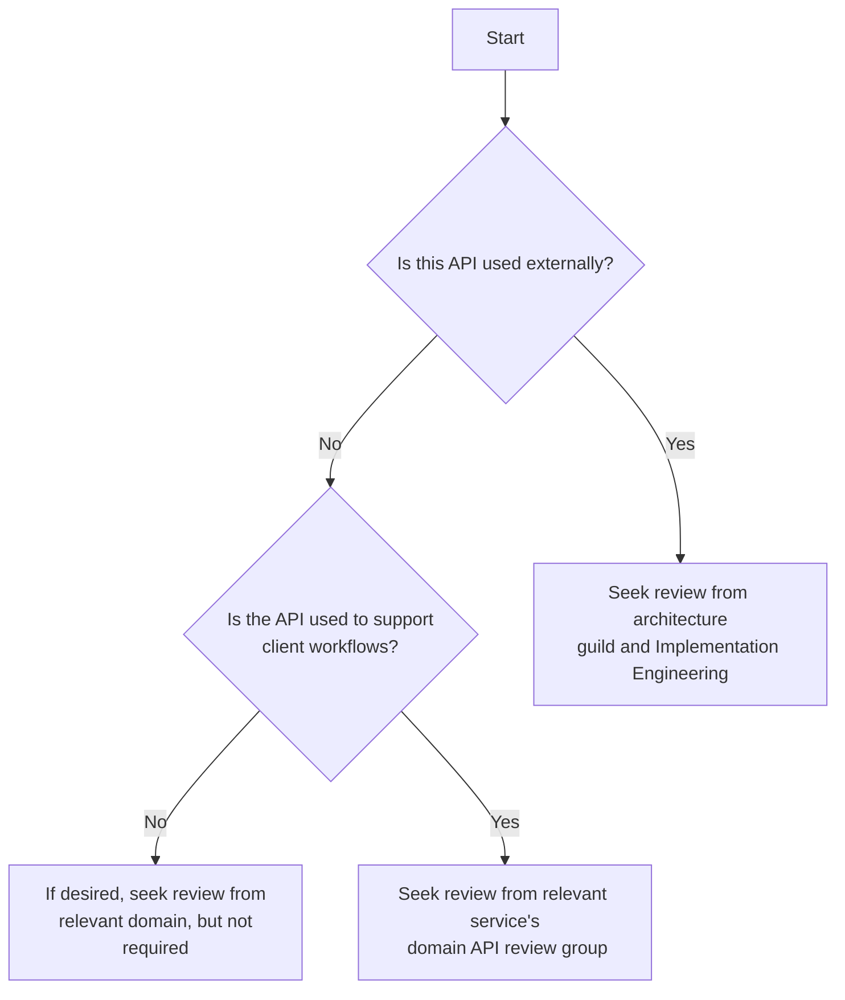

## Review Process

API design policy is only as useful as the enforcement of those policies.
To help ensure APIs adhere to policy they **should be reviewed**.  In many cases
APIs **must** be reviewed.  This page describes the mechanics involved.

Google’s own process for API review can be found in
[AIP-100](https://google.aip.dev/100).

{}
All [code changes](https://takeofftech.atlassian.net/wiki/spaces/EN/pages/1451295103/Code%2BReview%2BProcess) must be peer reviewed in compliance with our corporate change management process.
{}

Just like code review, API review helps us:

- Ensure policy is being followed
- Identify areas where policy might be out of date or missing
- Identify areas where we have lots of churn / need re-design
- Fill the gap of missing automation/linting for API content

Teams should design new functionality by considering its API _first_, before
authoring any backend code. This is the same as understanding the inputs and
outputs of your system before trying to develop the system. API reviews should
not constrain feedback based on underlying code that is authored in ways that
inhibit adopting best practices. Newly written code is not a valid
[precedent]().

The following kinds of API changes must be reviewed:

- Updates to APIs which drive customer workloads but are not externally
  accessible must trigger review within the relevant domain
  - Example: OMS’s endpoints should trigger outbound domain review
  - If a second domain will be consuming the endpoint, they should be involved
    as well

- Updates to API exposed externally should trigger review within the
  architecture guild and include Implementation Engineering for a representative
  for clients' perspective
  - Example: “RINT” service’s endpoints must trigger guild review in most cases.
    - *NOTE:* We expect that in the future teams will directly provide public APIs
      without the "RINT" system in between.

The following cases **do not** require review:

- Internal tools that do not directly handle customer workloads
  - Example: endpoints in calyx

The review is complete when the relevant reviewing group has given an approval
on the PR or the PR is closed.

For those who learn via visuals, here's a simple flow chart to guide you:

## Review setup

To enable this process a few prerequisite steps are required:

1. The API review groups must be created.
2. APIs must be documented statically in a git repository
3. The files that compose the API must be marked as owned by the relevant
   reviewing group using github’s
   [CODEOWNERS](https://docs.github.com/en/repositories/managing-your-repositorys-settings-and-features/customizing-your-repository/about-code-owners)
   capabilities

Note that this **does not** mean you must statically define a swagger, OpenAPI
or gRPC spec. We intend to have coverage of APIs within legacy services that
document their specifications via in-code metadata like compojure and django
provide.

{}
In the future we may change this guidance to require OpenAPI or gPRC
specification to enable more automatic linting and consistency between services.
{}

Care should be taken in repository configuration to ensure that required reviews
are set up appropriately. Teams must keep CODEOWNER mappings updated.

Domain leads are reponsible for creating and maintaining the membership of the
github review groups and communicating them to their teams for use in CODEOWNER
files.

