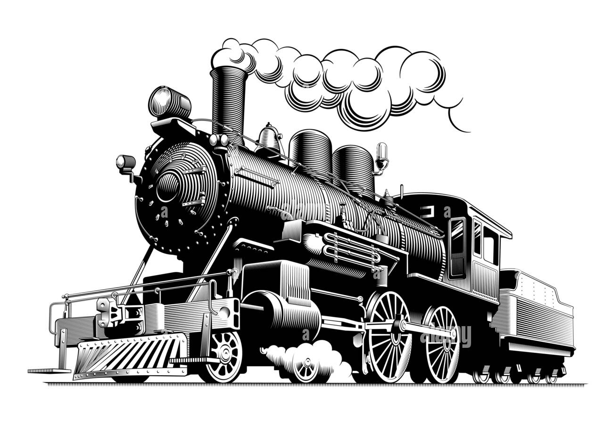

<!-- PROJECT LOGO -->
 

  

<h3 align="center">Release Train Management</h3>

  

    This repo is used for automated Release Train management and related operations.
  

<!-- ABOUT THE PROJECT -->

# About The Project

<!-- [![Product Name Screen Shot][product-screenshot]](https://example.com) -->

This project is designed to manage Takeoff's [Release Train](https://engineering-handbook.takeofftech.org/docs/domains/production/release-trains/) (RT) deployments through a collection of automated and semi-automated processes.

At a high level, these include: 
- Automated and Manually-triggered Release Train creation.
- Managing which clients and envs are blocked from automated RT deploys.
- Managing and updating RT service versions.
- Automated RT deploys to QAI, PROD, UAT, and pre-go-live environments on a set schedule.
- Triggering the creation of [On-Demand Environments (ODEs)](https://github.com/takeoff-com/release-train-management/blob/master/.github/workflows/deploy-to-ode.yaml).
- Triggering the ceation of [Test Plans and Test Runs in Testrail](https://github.com/takeoff-com/release-train-management/blob/master/.github/workflows/deploy-to-ode.yaml), as well as reporting the results of Release Qualification tests to Testrail.
- Getting the latest `master` service versions.

* * *

## Table of Contents

 * [How Tos](./docs/how-to/00-How-to.md), including: 
      * [Create an RT (Perform an RT Cut)](/docs/how-to/01-perform-rt-cut.md)
      * [Block RT deploys for one or more clients and envs](/docs/how-to/02-block-deploy-to.md)
      * [Manually deploy an RT to a client env that has been blocked](/docs/how-to/03-manual-rt-deploy.md)
      * [Trigger deployment of an On-Demand Environment (ODE)](/docs/how-to/04-deploy-an-ode.md)
      * [Update RT Service versions for one or more clients](/docs/how-to/05-update-services.md)
      * [Get latest Master versions](/docs/how-to/06-get-latest-master.md)
 * [Project Structure](./docs/structure/00-project_structure.md)
 * [Scheduled Automation Events](./docs/scheduled-events/00-scheduled-events.md)
 * [Contact](#contact)

<!-- CONTACT -->
## Contact

* [Team Chamaeleon](https://takeofftech.atlassian.net/jira/people/team/bde44f31-3d2a-4dba-b037-44cd57874e0f)
* Slack Channel: [#domain-production](https://takeofftech.slack.com/archives/C027W27MHEY)

(<a href="#top">back to top</a>)

